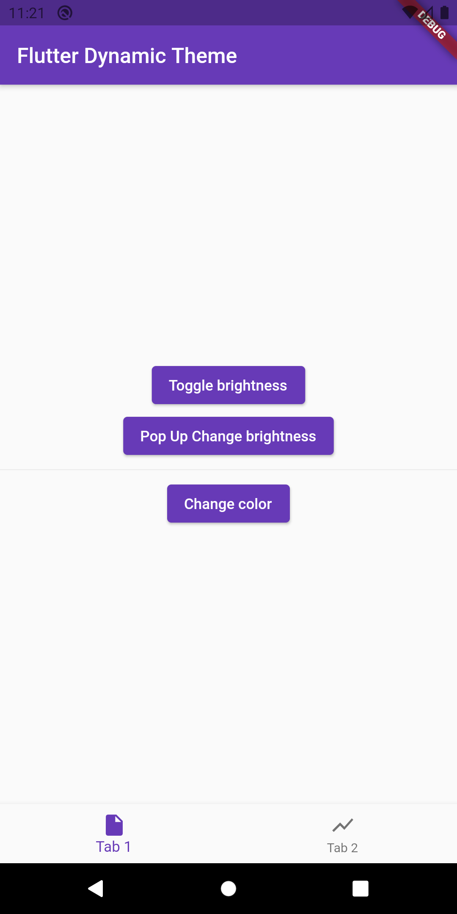
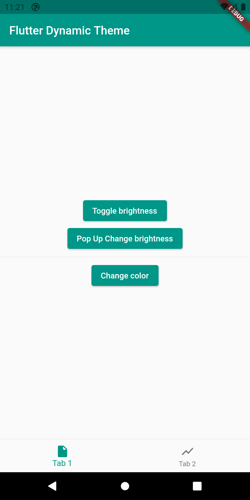
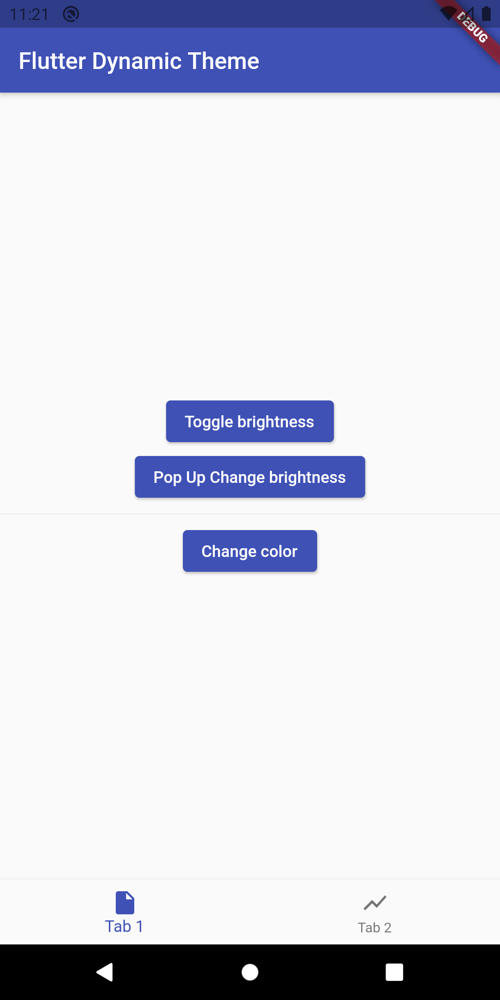
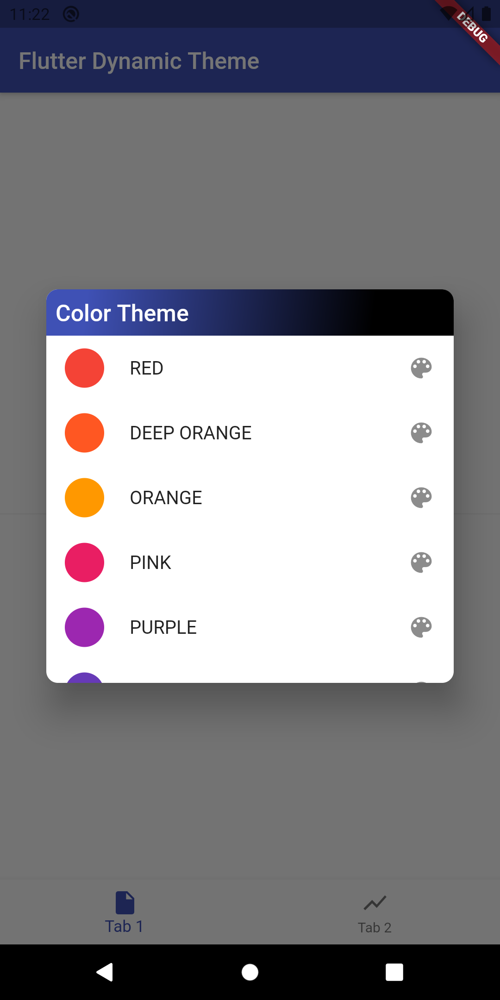
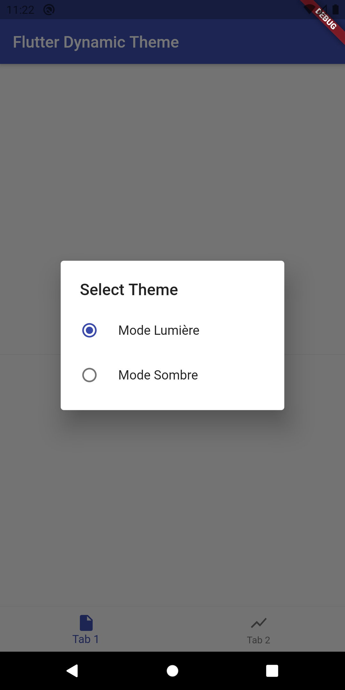
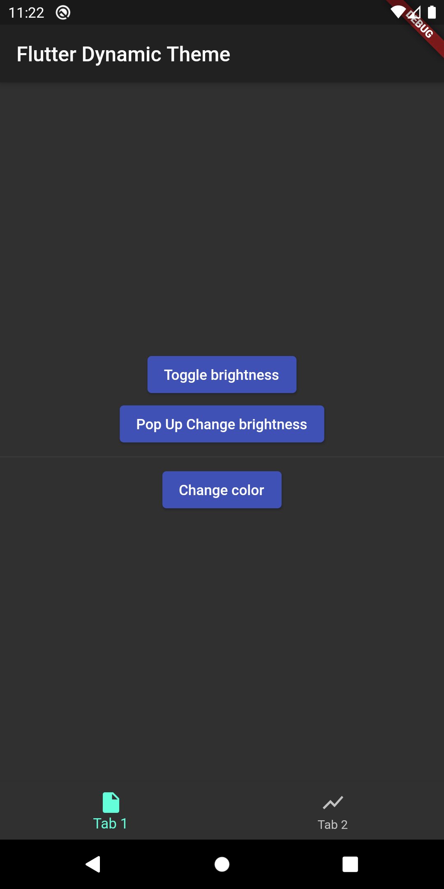

# flutter_dynamic_theme

Allows you to specify a number of color themes from which the user can choose. The selected theme persists when the application is restarted.

## Include in your project
```
dependencies:
  flutter_dynamic_theme: ^1.0.1
```
run packages get and import it
```
import 'package:flutter_dynamic_theme/flutter_dynamic_theme.dart';
```
if you want the dialog:
```
import 'package:flutter_dynamic_theme/theme_switcher_widgets.dart';
```
if you want the list of colors:
```
import 'package:flutter_dynamic_theme/dynamic_colors.dart';
```








## Getting Started

Follow the instructions [here](https://pub.dev/packages/flutter_dynamic_theme/install).

## Maintainer

* [Jean Fritz DUVERSEAU](https://github.com/Grafritz)

If you experience any problems using this package, please [create an issue on Github](https://github.com/Grafritz/flutter_dynamic_theme/issues). Pull requests are also very welcome.

Many thanks to the [dynamic_theme](https://pub.dev/packages/dynamic_theme) package from [
Norbert Kozsir](https://github.com/Norbert515) this package was inspired by!

For help getting started with Flutter, view our
[online documentation](https://flutter.dev/docs), which offers tutorials,
samples, guidance on mobile development, and a full API reference.

