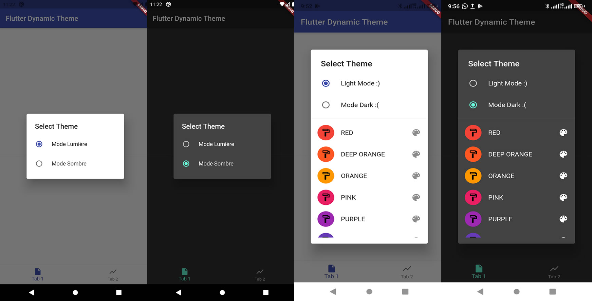

# flutter_dynamic_theme

Vous permet de spécifier un certain nombre de thèmes de couleurs parmi lesquels l'utilisateur peut choisir. Persiste le thème sélectionné lors des redémarrages de l'application.

Allows you to specify a number of color themes from which the user can choose. The selected theme persists when the application is restarted.

## Include in your project
```
dependencies:
  flutter_dynamic_theme: <lastedVersion>
```
run packages get and import it
```
import 'package:flutter_dynamic_theme/flutter_dynamic_theme.dart';
```
if you want the dialog:
```
import 'package:flutter_dynamic_theme/theme_switcher_widgets.dart';
```
if you want the list of colors:
```
import 'package:flutter_dynamic_theme/dynamic_colors.dart';
```



## Getting Started

Follow the instructions [here](https://pub.dev/packages/flutter_dynamic_theme/install).
```
class MyApp extends StatelessWidget {
  @override
  Widget build(BuildContext context) {
    return FlutterDynamicTheme(
      defaultBrightness: Brightness.light,
      data: (Brightness brightness) => ThemeData(
        primarySwatch: Colors.purple,
        brightness: brightness,
      ),
      loadBrightnessOnStart: true,
      themedWidgetBuilder: (BuildContext context, ThemeData theme) {
        return MaterialApp(
          title: 'Flutter Demo',
          theme: theme,
          home: const MyHomePage(title: 'Flutter Demo Home Page'),
        );
      },
    );
  }
}
```
To change the color theme
```
FlutterDynamicTheme.of(context)?.setThemeData(new ThemeData(primarySwatch: Colors.red));
```
or
```
FlutterDynamicTheme.of(context)?.setThemeData(new ThemeData(primaryColor: Colors.red));
```
Show popUp to change Brightness or and Color at the same time.
```
void showChooser() {
    showDialog<void>(
      context: context,
      builder: (BuildContext context) {
        return BrightnessSwitcherDialog(
          activeToggleMode: true,
          activeColor: true,
          textDarkMode: 'Mode Dark :(',
          textLightMode: 'Light Mode :)',
          onSelectedTheme: (Brightness brightness) {
            FlutterDynamicTheme.of(context).setBrightness(brightness);
          },
        );
      },
    );
  }
```
set ``activeColor: true`` to Activate option list of color
```
activeColor: true
```


## Maintainer

* [Jean Fritz DUVERSEAU](https://github.com/Grafritz)

If you experience any problems using this package, please [create an issue on Github](https://github.com/Grafritz/flutter_dynamic_theme/issues). Pull requests are also very welcome.

Many thanks to the [dynamic_theme](https://pub.dev/packages/dynamic_theme) package from [
Norbert Kozsir](https://github.com/Norbert515) this package was inspired by!

For help getting started with Flutter, view our
[online documentation](https://flutter.dev/docs), which offers tutorials,
samples, guidance on mobile development, and a full API reference.


This project is a starting point for a Flutter
[plug-in package](https://flutter.dev/developing-packages/),
a specialized package that includes platform-specific implementation code for
Android and/or iOS.

For help getting started with Flutter, view our
[online documentation](https://flutter.dev/docs), which offers tutorials,
samples, guidance on mobile development, and a full API reference.

[Publishing  package](https://docs.flutter.dev/development/packages-and-plugins/developing-packages)
